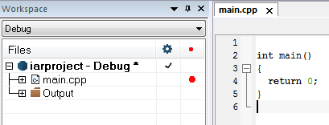
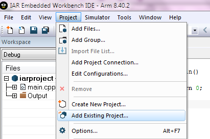
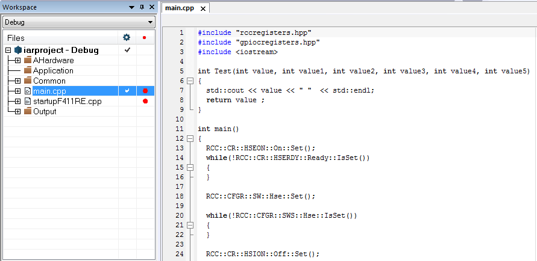
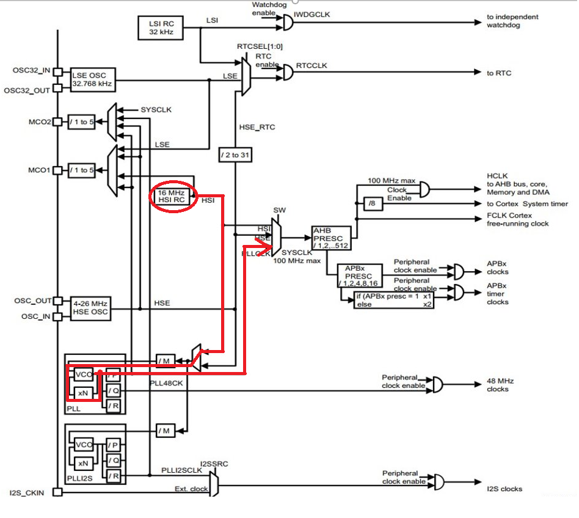
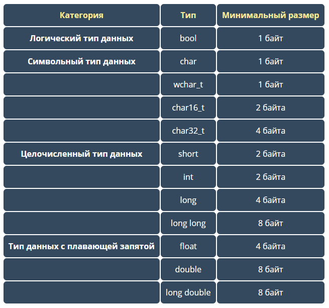

= Работа в IAR Embedded Workbench

=== *_Первое задание:_*
_Настроить внешний источник частоты HSE и
подключить его на системную шину._

_Прошить программу морганиями светодиодом -- проверить, что они
моргают._

Для начала необходимо создать проект C++ в программе
*IAR Embedded Workbench* (рисунок 1).

.Создание проекта в программе

Код программы и запуск представлены на рисунке 2.

.Устанока внешнего источника частоты HSE

После того как программа была запущена, видно, что светодиод на
плате начал мограть.

Частота внешнего высокочастотного
генератора частоты (HSE) равна 8 МГц.

=== *_Второе задание:_*
_Настроить внутренний источник частоты HSI и
подключить его на системную шину._

_Прошить программу морганиями светодиодом --
проверить, что они моргают быстрее в 2 раза._

На рисунке 3 представлена установка внутреннего источника частоты HSI.

.Установка внутреннего источника частоты HSI

После того  как программа была запущена, видно, что светодиод на плате
начал мограть в два раза быстрее, чем в первом случае.

Частота внутреннего высокочастотного RC-генератора (HSI) равна 16 МГц.

=== *_Третье задание:_*
_Настроить PLL источник тактовой частоты на 32 Мгц и подключить
его на системную шину._

_Прошить программу морганиями светодиодом - проверить, что они моргают
еще в 2 раза быстрее чем в пункте 2._

На рисунке 4 предсавлена настройка PLL источника тактовой частоты.

.Настройка PLL
image::Pics/file4.png[]

Необходимо правильно настроить фазовую автоподстройку частоты (ФАПЧ).
Для этого нужно сначала использовать источник HSI (16 МГц), а от него пошли
далее по следующей схеме:

.Система тактирования микроконтроллера STM32F411

После того как частота была настроена правильно стало видно, что светодиод стал
моргать ещё быстрей, чем в пункте 2. Частота с использованием
ФАПЧ (PLL) равна 32 МГц.

== Ответы на вопросы

=== *_1. Что такое POD типы данных?_*

_POD_ типы в языке _C++_ это аббревиатура от "_Plain Old Data_",
что можно трактовать как "Простые данные в стиле C".

Все типы делятся на две группы: объектные типы и все
остальные. К не объектным типам относятся функции,
ссылки и тип _void_. У таких типов, нельзя узнать размер
с помощью операции _sizeof_.

Группа объектных типов содержит две подгруппы – POD и
не-POD типы.

*К POD-типам относятся:*

- все встроенные арифметические типы (включая _wchar_t_
и _bool_);

- перечисления, т.е. типы, объявленные с помощью ключевого
слова _enum_;

- указатели;

- POD-структуры (_struct_ или _class_) и POD-объединения
(_union_).

*Чтобы структура была POD-типом, она должна удовлетворять
следующим требованиям:*

- не иметь пользовательских конструкторов, деструктора или
копирующего оператора присваивания;

- не иметь базовых классов;

- не иметь виртуальных функций;

- не иметь защищенных (_protected_) или закрытых (_private_)
нестатических членов данных;

- не иметь не статических членов данных не-POD-типов
(или массивов из таких типов), а также ссылок.

Копирующий оператор присваивания – это такой не шаблонный
нестатический *operator=*, у которого есть строго один
параметр типа *X, X&, const X&, volatile X&* или
*const volatile X&*, где *X* – тип рассматриваемой структуры
или объединения.

Все оставшиеся объектные типы являются не-POD-типами.
Наличие квалификаторов _const_ и _volatile_ не влияет на
"POD-овость" типа.

POD типы были введены чтобы разделить работу со старыми
типами языка _С_ и новыми в _С++_. При работе с POD типами
известно их размещение в памяти, а так же работают все
средства из С. Например можно пользоваться функциями
_memset_, _memcopy_.

=== *_2. Назовите все виды типов в языке С++._*

Основные типы данных в C++:

- *_int_* — целочисленный тип данных.

- *_float_* — тип данных с плавающей запятой.

- *_double_* — тип данных с плавающей запятой двойной точности.

- *_char_* — символьный тип данных.

- *_bool_* — логический тип данных.

=== *_3. Что такое пользовательский тип?_*

_Пользовательские типы данных_ — это типы данных,
которые могут быть созданы пользователем на основе того,
что доступно в языке.

Ключевое слово _typedef_ в языке C++ позволяет создавать
пользовательские типы данных – для этого достаточно
определить новое имя типа данных для уже существующего
типа данных. При этом сам новый тип данных не создается,
а лишь определяется новое имя для уже существующего типа.
Благодаря использованию пользовательских типов можно
делать программы более гибкими: для этого иногда достаточно
изменить _typedef_-инструкции с помощью макросов подстановки
(*#define*). Использование пользовательских типов позволяет
также улучшить читабельность кода, поскольку для стандартных
типов данных с помощью typedef можно использовать
собственные описательные имена.

Общий формат записи инструкции для создания пользовательского
типа:

 _typedef_ тип новое_имя;

=== *_4. Назовите модификаторы типов._*

Модификаторы типов:

- *_signed_*;
- *_unsigned_*;
- *_long_*;
- *_short_*.

Модификаторы _signed_, _unsigned_, _long_ и _short_ могут
применяться к целым базовым типам. Кроме того, _signed_ и
_unsigned_ могут применяться к _char_, и _long_ можно применять
к _double_.

Модификаторы _signed_ и _unsigned_ также могут использоваться
в качестве префикса для _long_ или _short_ модификаторов.
Например, _unsigned long int_.

C++ допускает сокращенное обозначение для объявления
_unsigned_, _short_, или _long_ целых чисел. Вы можете просто
использовать слово _unsigned_, _short_ или _long_, без _int_.
Это автоматически подразумевает _int_.

=== *_5. Назовите правило установки размеров типов._*

На рисунке 1 представлена таблица с минимальными размерами
типов данных.

.Размеры типов С++

=== *_6. Что делает оператор sizeof()?_*

Фактический размер переменных может отличаться на разных
компьютерах, поэтому для его определения используют
оператор _sizeof_.

*Оператор sizeof* — это унарный оператор, который вычисляет
и возвращает размер определенной переменной или определенного
типа данных в байтах.

Использование _sizeof_ помогает создавать переносимый код
для тех случаев, когда код зависит от размера стандартных
типов данных С.

=== *_7. Что характеризует тип std::size_t?_*

Тип _size_t_ -- базовый беззнаковый целочисленный тип
языка С/С++. Является типом результата, возвращаемого
оператором _sizeof_. Размер типа выбирается таким образом,
чтобы в него можно было записать максимальный размер
теоретически возможного массива любого типа.

Другими словами в переменную типа _size_t_ может быть
безопасно помещен указатель. Исключение составляют
указатели на функции классов, но это особый случай.

=== *_8. Назовите фиксированные типы целых в библиотеке std._*

НЕ ЗНАЮ......

=== *_9. Что такое псевдоним типа?_*

Запуталась, 3 вопрос и этот, typedef походу для псведонимов, или нет
подумой.........

=== *_10. Что такое явное и неявное преобразование типа?_*

*Неявное преобразование типов*, когда компилятор автоматически
конвертирует один фундаментальный тип данных в другой.

*Явное преобразование типов*, когда разработчик использует один
из операторов явного преобразования для выполнения конвертации
объекта из одного типа данных в другой.

=== *_11. Какие явные преобразования типов вы знаете?_*

В языке _C++_ есть 4 вида операций явного преобразования типов:

- применение оператора *static_cast*;
- применение оператора *const_cast*;
- применение оператора *dynamic_cast*;
- применение оператора *reinterpret_cast*.

=== *_12. Что делает reinterpret_cast?_*

*reinterpret_cast* преобразует типы, несовместимыми друг с другом.

Он используется для преобразования:

- В свой собственный тип.
- Указателя в интегральный тип.
- Интегрального типа в указатель.
- Указателя одного типа в указатель другого типа.
- Указателя на функцию одного типа в указатель на функцию
другого типа.

=== *_13. Чем static_cast отличается от reinterpret_cast?_*

*static_cast* осуществляет правильную работу с адресами, в то
время как *reinterpret_cast* просто интерпретирует указатель,
так как "приказывает" программист, не меняя его значения.

=== *_14. Что такое ОЗУ и ПЗУ?_*

_ОЗУ (оперативное запоминающее устройство)_ является энергозависимой
памятью. Это означает, что информация, временно хранящаяся
в модуле, стирается при перезагрузке или выключении компьютера.
Поскольку информация хранится на транзисторах с электрическим питанием,
при отключении электрического тока данные исчезают.

_ПЗУ (постоянное запоминающее устройство)_ является энергонезависимой памятью. Это означает, что
информация хранится на микросхеме постоянно. Для хранения данных
этой памяти не нужно электропитание, данные записываются в
отдельные ячейки памяти в форме двоичного кода. Энергонезависимая
память используется для неизменяемых компонентов компьютера,
например, для загрузочной части программного обеспечения или
служебных команд встроенного ПО, которые запускают принтер.

=== *_15. Каков размер памяти ARM Cortex микроконтроллеров._*

Ядро ARM имеет 4 Гбайт последовательной памяти с
адресов 0x00000000 до 0xFFFFFFFF.

=== *_16. По какой архитектуре разработан ARM Cortex микроконтроллер?_*

По Гарвардской архитектуре.

=== *_17. В чем отличие Гарвардской архитектуры от архитектуры ФонНеймана?_*

Основное отличие в том, что архитектура ФонНеймана использует
единую память (общую шину данных), а Гарвардская предполагает
наличие нескольких шин (в оригинале две: шина данных и шина команд),
повышая таким образом скорость по сравнению со случаем
использования одной шины в архитектуре ФонНеймана.

=== *_18. Где располагаются локальные переменные?_*

Переменные, определенные внутри блока, называются *локальными*
переменными. Располагаются в регистрах или в стеке.

=== *_19. Где располагаются статические переменные?_*

Статические переменные размещаются в области глобальной памяти.

=== *_20. Где располагаются глобальные переменные?_*

Располагаются в области глобальной памяти.
Обычно глобальные переменные объявляют в верхней части кода,
ниже директив *#include*, но выше любого другого кода.

=== *_21. Что такое стек?_*

В *стек* можно положить данные, и можно данные забрать, причем
те данные которые были положены в стек последним, забираем
из стека первыми.

*Стек* – это организация памяти, выполненная компоновщиком.
На уровне микроконтроллера для работы со стеком есть специальные
ассемблерные команды (например _PUSH_ – положить регистры в стек,
и _POP_ – взять из стека). Так же для сохранения и считывания
данных из стека могут использоваться инструкции _STR_ и _LDR_.

Обычно в стеке сохраняются регистры когда вы вызываете
подпрограмму, или проваливаетесь в прерывание, для того,
чтобы когда вернуться обратно в вашу программу восстановить
весь контекст и все переменные. Кроме того, если в вашей функции
передается слишком много переменных и под все не хватит
регистров, то компилятор расположит их также на стеке.
Локальные переменные функции также создаются на стеке.

=== *_22. Что такое указатель?_*

*Указатель* – переменная, значением которой является адрес
ячейки памяти. То есть указатель ссылается на блок данных
из области памяти, причём на самое его начало. Указатель может
ссылаться на переменную или функцию. Для этого нужно знать адрес
переменной или функции.

=== *_23. Что такое разыменовывание указателя?_*

Операция *разыменования указателя* представляет выражение
в виде _*имя_указателя_. Эта операция позволяет получить
объект по адресу, который хранится в указателе.

=== *_24. Что означает взятие адреса?_*

*Оператор &* - это унарный оператор, возвращающий адрес операнда.
Например:

 р = &num;

помещает адрес переменной _num_ в _р_. Данный адрес соответствует
внутреннему положению переменной в компьютере. Он ничего не
делает со значением _num_. Операцию *&* можно рассматривать как
"_взятие адреса_". Следовательно, предыдущий оператор присваивания
можно прочитать как «_p_ получает адрес _num_».

=== *_25. Какие операции можно выполнять над указателями?_*

Указатели поддерживают ряд операций: присваивание, получение
адреса указателя, получение значения по указателю, некоторые
арифметические операции и операции сравнения.

=== *_26. Что такое константный указатель?_*

*Константный указатель* — это указатель, значение которого не может
быть изменено после инициализации.

Подобно обычным константным переменным, константный указатель
должен быть инициализирован значением при объявлении.
Это означает, что он всегда будет указывать на один и тот же
адрес.

=== *_27. Что такое указатель на константу?_*

*Указатель на константу* — это неконстантный указатель,
который указывает на неизменное значение. Для объявления
указателя на константное значение, используется ключевое слово
_const_ перед типом данных.

=== *_28. Что такое ссылка? В чем её отличие от указателя?_*

Ссылка — это объект, указывающий на определенные данные,
но не хранящий их. (Ссылка это псевдоним переменной).

- У ссылки нельзя взять адрес. Если применить оператор
взятия адреса к ней, то будет выведен адрес переменной,
на которую она ссылается.
- Ссылка ведет себя почти также как константный указатель.
Её нельзя изменять, складывать, вычитать.
- Ссылки нельзя сравнивать.
- Ссылка не может быть не проинициализирована.

Главное отличие ссылки от указателей: указатель это целое число,
для ссылки доступны только 2 операции: копирование и разыменование.

=== *_29. Что такое регистр?_*

